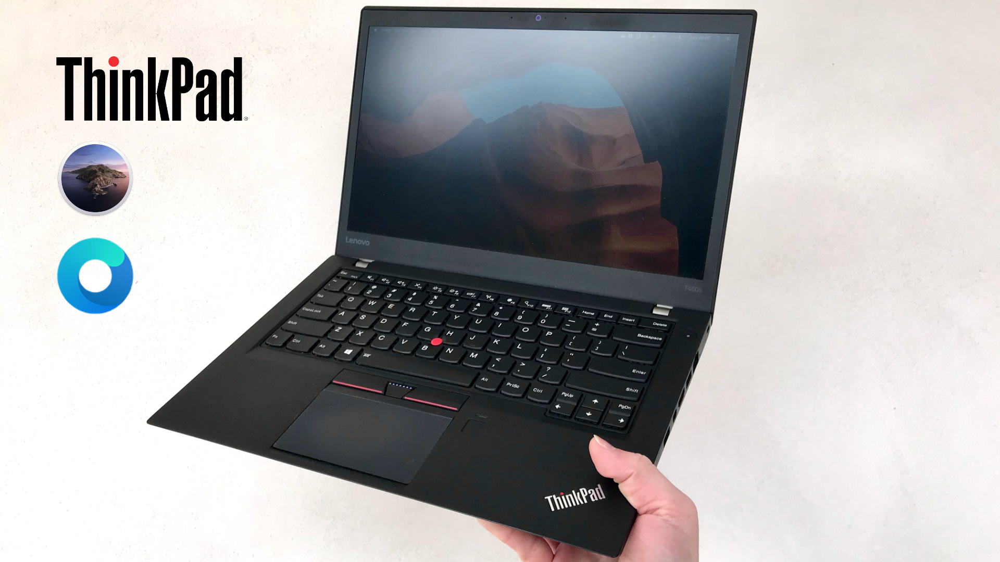

## OpenCore N-D-K build is live with GUI! | [Why OpenCore?](https://desktop.dortania.ml/#advantages-of-opencore)
## Try it out with fresh install or preinstalled system!
```
This configuration is fully compatible with OpenCore official build and dual booting with Windows.
The reason to go default with N-D-K build is to retain preinstalled Windows system compatibility.
If you planning to fresh install then either N-D-K or Official OC can be used.
```



### Laptop's Configuration

- <b>Model</b>: Thinkpad T460
- <b>CPU</b>: Intel Core i5-6300U
- <b>GPU</b>: Intel HD Graphics 520
- <b>RAM</b>: 8 GB 1600MHz DDR3L
- <b>Storage</b>: 240GB Gigabyte SATA SSD
- <b>Camera</b>: HD 720p
- <b>Sound</b>: Realtek ALC293
- <b>Screen</b>: 14" FHD (1920x1080) IPS LGD Touch Panel
- <b>Ethernet</b>: Intel I219-V PCIe Gigabit Ethernet
- <b>WLAN + BT</b>: ~~Intel AC 8260, 2x2 + BT 4.1~~ **Upgraded with DW1820A**
- <b>Battery</b>: 3-cell (23Wh) + 6-cell (72Wh)

### Patreon Support

> If you like my work then please feel free to buy me a bear. Your support will keep me hackintoshing. Thanks!

> <a href="https://www.patreon.com/bePatron?u=33582929" data-patreon-widget-type="become-patron-button">Become a Patron!</a>

### General Knowledge & Credits

- First credit goes to [tluck](https://github.com/tluck/Lenovo-T460-Clover) for making a perfect working build. This is a heavily reworked version of tluck's build as base. Support can be found from [tluck's Guide](https://www.insanelymac.com/forum/topic/315451-guide-lenovo-t460t470-macos-with-clover/) thread on InsanelyMac.

- Lots of SSDT patches from [OC-little](https://translate.google.it/translate?sl=zh-CN&tl=en&u=https%3A%2F%2Fgithub.com%2Fdaliansky%2FOC-little)

- Useful tools by [CorpNewt](https://github.com/corpnewt)

- The holy grails [Acidanthera](https://github.com/acidanthera) that make this possible

### Build Features:

- This is a 100% working macOS Catalina setup! Nothing needs to be changed! Just swap your files with mine and enjoy! (WiFi upgrade needed for complete functionality)

- AppStore Purchases, iMessage, FaceTime, Instant Hotspot, Continuity, Handoff, AirDrop, iTunes Purchases, System Update, Siri, Metal, Sleep, Power Settings, Backlight Control, Touchpad Gestures (3 and 4 Finger Including Swipes) AirPort Extreme Functionality, Bluetooth, Location Services, iCloud Features are Fully supported with the proper AirPort card. Battery functioning properly thanks to hot patched files.

- Find My Mac only works with real AirPort card! If you lock the device via iCloud with a PC WiFi card (even with a supported chipset) you're gonna find yourself in a situation you don't want to deal with.


### Recommended Hardware Changes:

> Replace Intel WiFi card with a macOS supported card such as:

- DW1820A `need patch, but dart cheap ~15$`
- DW1830 `costly but works out of the box ~70$`
- BCM94360CS2 `native apple card, sidecar supported`

### BIOS Configuration Settings:

<b>Security</b>

- `Security Chip` **Disabled**
- `Memory Protection -> Execution Prevention` **Enabled**
- `Virtualization -> Intel Virtualization Technology` **Enabled**
- `Virtualization -> Intel VT-d Feature` **Enabled**
- `Anti-Theft -> Computrace -> Current Setting` **Disabled**
- `Secure Boot -> Secure Boot` **Disabled**
- `Intel SGX -> Intel SGX Control` **Disabled**
- `Device Guard` **Disabled**

<b>Startup</b>

- `UEFI/Legacy Boot` **UEFI Only**
- `CSM Support` **Yes**


### Installing OpenCore Boot-loader & macOS Catalina:

> To install macOS follow the guides provided by [Dortania](https://dortania.ml/getting-started/)

### What's Working

- [x] CPU Power Management
- [x] Intel HD Graphics (with QE/CI graphics acceleration)
- [x] All USB ports	(with dock port support)
- [x] mDP and HDMI port (with HDMI audio)
- [x] Internal Camera (with FaceTime)
- [x] LCD Touch Screen (require purchased Touch-Base driver)
- [x] Sleep / Wake / Shutdown / Reboot (with lid sleep and lid wake)
- [x] Intel I219V Ethernet port
- [x] Wifi, Bluetooth, Airdrop, Handoff, Continuity (with upgraded DW1820A)
- [x] iMessage, FaceTime, App Store, iTunes Store (need valid SMBIOS)
- [x] Mic in and Audio out (with audio through dock thanks to @tluck)
- [x] Dual Battery (very stable thanks to @tluck and @EchoEsprit)
- [x] Keyboard (with all fn Keys using [ThinkpadAssistant](https://github.com/MSzturc/ThinkpadAssistant), thanks to @MSzturc)
- [x] Trackpad, Trackpoint and Physical buttons (with native gestures)
- [x] SIP and FileVault 2 can be enabled (disabled by default in config.plist)


### What's not Working ⚠️

> If you have any questions or suggestions feel free to contact me

- [ ] SD Card Reader `Driver somewhat works with low speed and unstable`
- [ ] Fingerprint Reader `Don't think it will ever work on macOS`
- [ ] Sidecar Wireless `Doesn't work without apple native WIFI card`

### Support For Similar Hardware:

This post contain basically everything necessary to install macOS Catalina on a Lenovo ThinkPad T460.If you happen to have a similiar Thinkpad with 6th gen Skylake Intel processor (like X260, T460, T460p, T560, E560), there is a good chance that this EFI will work on it **with some precaution**:

- Double check your DSDT naming (like EC, LPC, KBD, etc.) with provided SSDTs naming
- Change iGPU inside cofing.plist according to your model (default is HD520)
- Follow USB ports map and CPU Power Management according to your hardware configuration.

Any other device will require that you make hotpatch for your own DSDT. Take a look in "Utilities/ACPI_Source" for my files and use them as a guide to make hotpatch for your own DSDT. Reffer to these SSDT patches from [OC-little](https://translate.google.it/translate?sl=zh-CN&tl=en&u=https%3A%2F%2Fgithub.com%2Fdaliansky%2FOC-little) for guidance. I strongly recommend that you choose to go with the Hot Patched configuration as it provides a number of benefits over the old method of Static Patching. First its already complete in this build which means you can just delete the contents of your "/Volumes/ESP/EFI/CLOVER" folder and then copy and paste the entire setup I've created into that same CLOVER folder. Hot Patching is capable of universal support across a wide range of comparable hardware so even if your laptop in not a T460 or Lenovo for that matter but it contains a Skylake processor and HD 520 Graphics then this setup will almost certainly work for you (with minor adjustments possibly needed in the config.plist or with kexts for other hardware not present in my configuration). The most beneficial reason for choosing the Hot Patched method though is that it requires no knowledge of how to patch an DSDT because hotpatch survives BIOS changes and updates! if ACPI files in new bios update doesn't break the acpi binary patch. Anyone who can copy and paste can use this build so long as there base configuration matches mine (refer to the first section of this guide for that information).

### Recomended Changes

#### USB Ports Map

Custom made SSDT-XHCI.aml is used to map T460 USB ports using this guide: [Native USB fix](https://www.olarila.com/topic/6878-guide-native-usb-fix-for-notebooks-no-injectorkext-required/).
Alternatively, USBPort.kext or SSDT-UIAC & SSDT-USBX can also be used as well. These files can be generated with [Hackintool](https://github.com/headkaze/Hackintool):

```
Use USBInjectAll.kext at first approach on new machine to activate all USB ports.
Then generate custom USB map according to your USB configuration with Hackintool.
Place USBPort.kext in OC/Kexts or SSDT-UIAC & SSDT_USBX in OC/ACPI (reflect these changes in config.plist)
and finally remove USBInjectAll.kext (reflect this change in config.plist)
```

#### CPU Power Management

This can be achieved by using [CPUFriend](https://github.com/acidanthera/CPUFriend) kext with custom CPU frequency data generated by [CPUFriendFriend](https://github.com/corpnewt/CPUFriendFriend). This tool generates either `CPUFriendDataProvider.kext` or `SSDT-DATA.dsl`. Use only one of them to achieve native CPU power management.

On my machine [CPUFriendFriend](https://github.com/corpnewt/CPUFriendFriend) was used to set:

```
Low Frequency Mode (LFM) = 400MHz (TDP-down frequency for i5-6300u)
Energy Performance Preference (EPP) = 80 (Balance power)
```

If you have a different CPU model, please, **remove SSDT-CPUD.aml and replace with new generated SSDT-DATA.aml**, power management is natevely handled by this way.

### Optional Changes

#### Generate your own SMBIOS

[GenSMBIOS](https://github.com/corpnewt/GenSMBIOS) run the script with CPU matching mac device Product Name e.g. MacbookPro13,1 in my case. Then add results in config.plist:
```
PlatformInfo > Generic > MLB, SystemSerialNumber and SystemUUID
```

#### Enable macOS Native HiDPI

With [one-key-hidpi](https://github.com/xzhih/one-key-hidpi). Run this command in terminal:
```
bash -c "$(curl -fsSL https://raw.githubusercontent.com/xzhih/one-key-hidpi/master/hidpi.sh)"
```

#### Use PrtSc key as Screenshot Shortcut

PrtSc is already mapped to F13 by SSDT-KBRD.aml only set the shortcut under:
```
SystemPreferences > Keyboard > Shortcuts > Screenshots
```
#### Disable Wake on Wi-Fi

Wi-Fi transfer rate happen to be reduced after wake from sleep. To fix that, set:
```
SystemPreferences > Energy Saver > Power Adapter > Wake for Wi-Fi network access > Disable
```

#### Make dock animation faster and without delay

Run these commands in terminal:
```
defaults write com.apple.dock autohide-delay -float 0
defaults write com.apple.dock autohide-time-modifier -float 0.5
killall Dock
```

### Miscellaneous Information:

- Make sure your bios settings are in order, disable CompuTrace all security chips network booting turn your video men as hit as you can, disable fingerprint sensor because you won’t need it, to play around with a few other settings to get a successful boot if it doesn't work the beginning. Also make sure you enable CSM for UEFI booting because that's what you'll be using this is not a Legacy install.

- Once you get the USB loaded for install, prepare the drive with disk utility and format it as APFS and then install to that drive. About halfway through the install the computer is going to restart it may even restart twice, that’s normal the install did not fail are you need to do is instead of selecting an install Mac OS from install Mac OS you want to select install Mac OS from “whatever you chose the name your drive when you formatted it”. If it restarts again do the same thing allow to continue.

- Once the install finishes go through the setup process take the contents of the install folder which will be just like you used for the USB installer instead move all those contents to the EFI directory of the Drive that used to install Mac OS on because this will be your permanent clover set up. Once you do that you should then be able to into Clover every time you start up and then go directly to your macOS. There are ways to configure it so that you can start directly in the Mac OS but you'll have to figure that out on your own.

- If you decide to go with a USB Wifi dongle instead of upgrading the PCIe card then keep in mind that you will not get the full functionality you would have with an official AirPort module such as AirDrop and Location Services. I suggest using the Asus USB-53 Nano Wireless A/C dongle Because I know for a fact it works with this build and macOS Catalina in general. You'll need to install the driver and wireless utility that comes with it or dl it from Asus' website and then reboot the computer and it will work. You can even open up the computer and unscrew the 3rd USB port that's seated next to the power port on the computer and then you can just plug the USB module in and push the board back from it's seating slightly then close up the case and then you'll have wifi without that little USB module sticking out of the side of the computer all the time. I did this for a few weeks and it works great.

### If you found my work useful please consider supporting me on Patreon

> <a href="https://www.patreon.com/bePatron?u=33582929" data-patreon-widget-type="become-patron-button">Become a Patron!</a>

## Thanks to

All the hackintosh community, especially the devs of Acidanthera team.
